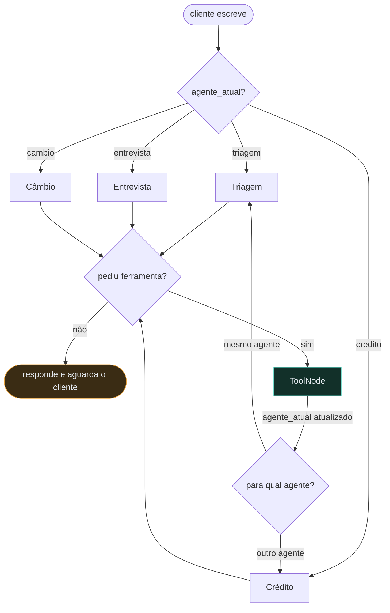

# Banco Ágil — Atendimento com Agentes de IA

Sistema de atendimento bancário conduzido por quatro agentes de IA
especializados, construído com **LangGraph** e **Google Gemini**, com interface
em **Streamlit**.

Para o cliente existe uma única atendente — a **Ági**. Por trás dela, quatro
agentes com escopos, prompts e ferramentas distintos se revezam de forma
invisível: um autentica, outro cuida de limite de crédito, outro conduz a
entrevista financeira e outro consulta câmbio.

---

## Sumário

1. [Visão geral](#1-visão-geral)
2. [Arquitetura](#2-arquitetura)
3. [Funcionalidades](#3-funcionalidades)
4. [Desafios enfrentados](#4-desafios-enfrentados)
5. [Escolhas técnicas](#5-escolhas-técnicas)
6. [Como executar](#6-como-executar)
7. [Testes](#7-testes)
8. [Estrutura do projeto](#8-estrutura-do-projeto)

---

## 1. Visão geral

O Banco Ágil é um banco digital fictício. O cliente abre o chat, é autenticado
por CPF e data de nascimento e, a partir daí, pode consultar limite de crédito,
pedir aumento, passar por uma entrevista financeira que recalcula seu score e
consultar a cotação de moedas em tempo real.

Três princípios guiaram a implementação:

**O estado manda, não o texto.** Se o cliente está autenticado, quantas
tentativas restam e qual agente detém o turno são campos do estado do grafo —
nunca inferências do modelo sobre o histórico da conversa. Um LLM pode ser
convencido por uma mensagem bem escrita de que já autenticou alguém; um `bool`
no estado, não.

**Escopo é ferramenta, não instrução.** "Nenhum agente pode atuar fora do seu
escopo" não é só uma frase no prompt: o agente de câmbio literalmente não
possui a ferramenta que grava pedido de aumento de limite. O escopo é uma
propriedade estrutural do grafo.

**A conversa nunca cai.** Base de dados ausente, CSV corrompido, API de câmbio
fora do ar, LLM em rate limit, resposta inválida do cliente — cada um desses
casos tem um caminho de tratamento que registra o erro técnico no log e devolve
ao cliente uma frase compreensível com uma alternativa.

---

## 2. Arquitetura

### 2.1 Os quatro agentes

| Agente | Escopo | Ferramentas |
|---|---|---|
| **Triagem** | Recepciona, autentica e direciona | `autenticar_cliente`, transferências para crédito/câmbio, `encerrar_atendimento` |
| **Crédito** | Limite atual e pedidos de aumento | `consultar_limite_credito`, `solicitar_aumento_limite`, `consultar_historico_solicitacoes`, transferências, `encerrar_atendimento` |
| **Entrevista** | Entrevista financeira e recálculo do score | `calcular_e_salvar_novo_score`, volta ao crédito, `encerrar_atendimento` |
| **Câmbio** | Cotação de moedas | `consultar_cotacao_moeda`, transferências, `encerrar_atendimento` |

Todos compartilham a mesma persona pública (`PERSONA_BASE` em
[`src/agents/prompts.py`](src/agents/prompts.py)). O que muda entre eles é o
escopo e o conjunto de ferramentas — nunca a voz.

### 2.2 O grafo



Cada agente é um **nó** do `StateGraph`. Um nó `ToolNode` executa as
ferramentas de todos eles. Duas arestas condicionais fazem todo o roteamento:

* **depois do agente** — se a resposta tem `tool_calls`, vai para o `ToolNode`;
  se não tem, o turno termina e o cliente recebe a fala;
* **depois das ferramentas** — volta para o agente indicado por `agente_atual`,
  que pode ser outro se uma transferência foi executada.

### 2.3 Como o handoff fica invisível

Este é o requisito mais sutil do desafio: *"os redirecionamentos devem ser
realizados de maneira implícita, de modo que o cliente não perceba a
transição"*.

A solução tem três partes:

1. **A transferência é uma tool call, não uma fala.** `transferir_para_credito`
   não produz texto para o cliente — devolve um `Command` que escreve
   `agente_atual: "credito"` no estado, mais uma `ToolMessage` que é uma
   *instrução interna* para o próximo agente ("você agora é o especialista em
   crédito, não se reapresente").

2. **O turno só termina quando um agente fala.** Como a aresta condicional só
   leva ao `END` quando a resposta do LLM não tem `tool_calls`, a sequência
   `triagem → autentica → transfere → crédito → consulta limite → responde`
   acontece dentro de **uma única invocação**. O cliente manda uma mensagem e
   recebe uma resposta.

3. **O prompt proíbe explicitamente a menção.** `PERSONA_BASE` lista
   "vou te transferir", "outro setor", "meu colega" como proibidos, e instrui
   que toda `ToolMessage` é instrução interna, nunca texto a ser lido.

O teste [`test_autentica_e_transfere_para_credito_em_um_unico_turno`](tests/test_fluxo_atendimento.py)
verifica exatamente isso: após um turno que passa por dois agentes e duas
ferramentas, existe **uma única** mensagem falada para o cliente.

### 2.4 O estado

```python
class EstadoAtendimento(TypedDict, total=False):
    messages: Annotated[list[AnyMessage], add_messages]
    agente_atual: NomeAgente          # mecanismo de handoff
    autenticado: bool
    tentativas_autenticacao: int
    cpf: str | None
    nome_cliente: str | None
    status_ultima_solicitacao: str | None
    entrevista_concluida: bool
    encerrado: bool
    motivo_encerramento: str | None
```

O estado é persistido por um `MemorySaver` com um `thread_id` por sessão, o que
mantém conversas simultâneas isoladas.

A cada turno, o estado relevante é **injetado no prompt do sistema** pela função
`_contexto_da_sessao` — o modelo sempre sabe se o cliente está autenticado e
quantas tentativas restam, sem precisar deduzir do histórico.

### 2.5 Sobre as bases de dados

O enunciado referencia `clientes.csv` e `score_limite.csv`, mas esses arquivos
não acompanhavam o desafio — **as três bases foram criadas neste projeto**:

* **`clientes.csv`** — oito clientes fictícios cobrindo toda a escala de score
  (de 180 a 880), para que cada faixa da política de limite tenha pelo menos um
  caso testável. Os CPFs são gerados com dígito verificador válido, já que a
  autenticação valida o dígito; um deles começa com zero, de propósito, para
  exercitar o tratamento descrito em 4.3.
* **`score_limite.csv`** — cinco faixas de score com o teto de limite
  correspondente. É a política de crédito do banco, editável sem tocar no
  código.
* **`solicitacoes_aumento_limite.csv`** — criado vazio, apenas com o cabeçalho.
  É preenchido pelo sistema, com as colunas exatas exigidas pelo enunciado.

**Uma nota sobre o vocabulário de status.** O enunciado especifica os valores
`'pendente'`, `'aprovado'` e `'rejeitado'` para a coluna `status_pedido`, mas
mais adiante, ao descrever o que fazer depois de uma recusa, usa a palavra
`'reprovado'`. Adotamos `'rejeitado'` em todo o sistema, por ser o termo da
especificação das colunas — que é o contrato do arquivo.

### 2.6 Fluxo dos dados

```
data/clientes.csv                    leitura: autenticação, limite, score
                                     escrita: novo score após a entrevista

data/score_limite.csv                leitura: teto de limite por faixa de score

data/solicitacoes_aumento_limite.csv escrita: cada pedido de aumento
                                     (grava 'pendente' → avalia → atualiza)

logs/banco_agil.log                  escrita: trilha técnica de erros
```

O acesso a CSV está isolado em [`src/repositories/`](src/repositories/). Nenhum
agente ou ferramenta abre arquivo diretamente.

**A ordem da escrita importa.** O enunciado pede que o pedido seja registrado e
*depois* analisado. O código segue essa ordem literalmente: grava a linha com
`status_pedido = 'pendente'`, consulta `score_limite.csv`, e só então atualiza
para `aprovado` ou `rejeitado`. Se a análise falhar no meio, o pedido continua
no arquivo como pendente — uma trilha de auditoria correta, não um registro
perdido.

**Aprovar efetiva o limite.** O enunciado descreve o pedido e seu status, mas
não diz explicitamente o que acontece com o limite do cliente depois da
aprovação. Optamos por fechar o ciclo: um pedido aprovado grava o novo
`limite_atual` em `clientes.csv`, de modo que a consulta seguinte já reflita a
decisão — caso contrário o cliente ouviria "aprovado" e continuaria vendo o
limite antigo.

A efetivação é tratada como um passo que pode falhar sozinho. Se a gravação do
limite não funcionar, o pedido **permanece aprovado** na auditoria e o cliente
é avisado de que a atualização aparecerá em instantes. Reverter para "não
aprovado" seria dar uma informação errada sobre uma decisão que já foi tomada.

---

## 3. Funcionalidades

### Agente de Triagem
- [x] Saudação inicial gerada pelo agente
- [x] Coleta de CPF com validação dos dígitos verificadores (algoritmo da Receita Federal)
- [x] Coleta da data de nascimento em múltiplos formatos (`14/03/1988`, `14-03-1988`, `1988-03-14`…)
- [x] Autenticação contra `clientes.csv` exigindo CPF **e** data
- [x] Identificação do assunto e encaminhamento ao agente correto
- [x] Máximo de 3 tentativas, com encerramento cordial após a terceira falha
- [x] Erro de *formato* (CPF curto, data ilegível) não consome tentativa
- [x] Nenhum encaminhamento acontece antes da autenticação — bloqueado pelo estado

### Agente de Crédito
- [x] Consulta do limite atual e do teto autorizado pelo score
- [x] Registro do pedido em `solicitacoes_aumento_limite.csv` com as cinco colunas exigidas
- [x] Timestamp em ISO 8601
- [x] Avaliação contra `score_limite.csv` → `aprovado` / `rejeitado`
- [x] Pedido aprovado **efetiva** o novo limite em `clientes.csv`
- [x] Em caso de rejeição, oferece a entrevista e **aguarda** a resposta do cliente
- [x] Se o cliente recusar, encaminha para outro assunto ou encerra
- [x] Consulta ao histórico de pedidos anteriores
- [x] Pedido de valor menor ou igual ao limite atual é recusado sem gerar registro

### Agente de Entrevista de Crédito
- [x] Cinco perguntas, uma por vez: renda, tipo de emprego, despesas, dependentes, dívidas
- [x] Cálculo do novo score (0 a 1000) pela fórmula ponderada
- [x] Atualização do score em `clientes.csv`
- [x] Retorno automático ao Agente de Crédito para nova análise
- [x] Sinônimos aceitos: "CLT" → formal, "freelancer"/"MEI"/"PJ" → autônomo
- [x] Resposta inválida não grava nada; a pergunta é refeita

### Agente de Câmbio
- [x] Cotação em tempo real via [AwesomeAPI](https://docs.awesomeapi.com.br/) (sem necessidade de chave)
- [x] Fallback automático para a ExchangeRate API se a primária falhar
- [x] 10 moedas: USD, EUR, GBP, ARS, JPY, CAD, AUD, CHF, BTC, ETH
- [x] Reconhece como o cliente fala: "dólar", "dolares", "euro", "bitcoin"
- [x] Encerramento amigável do assunto

### Regras gerais
- [x] `encerrar_atendimento` disponível em **todos** os agentes, a qualquer momento
- [x] Transferências implícitas — o cliente nunca percebe a troca
- [x] Escopo garantido estruturalmente pelo conjunto de ferramentas de cada agente
- [x] Tratamento de erro em toda operação de I/O, API e entrada do usuário
- [x] Log técnico em `logs/banco_agil.log` sem interromper a conversa
- [x] Interface Streamlit com painel de bastidores

---

## 4. Desafios enfrentados

### 4.1 Tornar a transferência realmente invisível

**Problema.** A primeira versão fazia a triagem responder "certo, um momento" e
só no turno seguinte o agente de crédito assumia. O cliente via duas mensagens
e uma pausa artificial — exatamente a transição que o enunciado proíbe.

**Solução.** Tornar o fim do turno uma consequência de *o agente ter falado*,
não de *uma ferramenta ter rodado*. A aresta condicional após cada agente só
leva ao `END` quando a resposta não tem `tool_calls`; enquanto houver
ferramenta pendente, o grafo continua girando. Assim a cadeia inteira —
autenticar, transferir, consultar, responder — cabe em uma volta.

Além disso, toda `ToolMessage` devolvida é escrita como instrução em segunda
pessoa dirigida ao agente ("informe o cliente que…"), nunca como texto pronto.
Isso reduziu drasticamente os casos em que o modelo lia a saída da ferramenta
em voz alta.

### 4.2 Um LLM não deve decidir se alguém está autenticado

**Problema.** Com a autenticação vivendo apenas na conversa, um cliente que
escrevesse *"já te passei meus dados, pode ver meu limite"* às vezes convencia
o modelo a seguir adiante.

**Solução.** `autenticado` e `tentativas_autenticacao` viraram campos do estado,
alterados **exclusivamente** pelo retorno da ferramenta que consultou o CSV. E
as próprias ferramentas de transferência verificam o estado antes de agir: se
`autenticado` é falso, a transferência é recusada e o agente recebe a instrução
de voltar a pedir os dados. Mesmo que o modelo tente pular a etapa, a estrutura
não deixa.

Coberto por `test_transferencia_e_bloqueada_sem_autenticacao`.

### 4.3 Zeros à esquerda no CPF

**Problema.** O CPF `08301661305` é uma string, mas o pandas infere `int64` ao
ler o CSV e devolve `8301661305` — dez dígitos. O cliente digitava o CPF certo
e a autenticação falhava, sem erro visível em lugar nenhum.

**Solução.** Toda a camada de persistência usa o módulo `csv` da biblioteca
padrão, que devolve tudo como `str`. Conversões de tipo são explícitas
(`campo_float`, `campo_int`) e erram alto quando o dado está malformado. Há um
teste de regressão para o caso (`test_preserva_zero_a_esquerda`).

### 4.4 Dois pedidos no mesmo segundo se sobrescreviam

**Problema.** Encontrado pelo teste `test_atualiza_status_da_linha_correta`.
A linha do pedido era identificada por CPF + timestamp, e o timestamp tinha
precisão de segundos. Um cliente que fizesse dois pedidos na mesma conversa
tinha o status do segundo gravado na linha do primeiro.

**Solução.** Timestamp com precisão de milissegundos (ainda ISO 8601 válido) e
busca pela linha de trás para frente, casando também pelo valor solicitado.

### 4.5 A fórmula de score estourava a escala

**Problema.** A fórmula do enunciado usa `(renda / (despesas + 1)) * 30`. Com
renda de R$ 50.000 e despesas zeradas, esse termo sozinho vale 1.500.000
pontos — o score satura em 1000 e emprego, dependentes e dívidas deixam de
importar. Um desempregado endividado com renda declarada alta teria score
máximo.

**Solução.** Um teto de 600 pontos no componente de renda
(`TETO_COMPONENTE_RENDA`), preservando o peso relativo dos demais fatores, e o
resultado final fixado na faixa 0–1000 (a penalidade por dívidas pode tornar a
soma negativa). Ambos os desvios estão documentados no código e cobertos por
teste.

### 4.6 O que só a execução real revelou

Dois problemas sobreviveram a 107 testes com LLM falso e só apareceram na
primeira conversa de verdade — um bom argumento para os testes de integração
existirem.

**O modelo saiu do ar.** `gemini-2.0-flash` foi descontinuado durante o
desenvolvimento e passou a responder 404. O padrão virou o alias
`gemini-flash-latest`, para que um clone feito meses depois não quebre de novo;
quem precisa de reprodutibilidade exata fixa `BANCO_AGIL_MODEL` no `.env`.

O episódio acabou sendo a melhor demonstração do tratamento de erros: a
conversa não caiu, o cliente recebeu *"tive uma instabilidade momentânea, pode
repetir?"* e o stack trace foi para `logs/banco_agil.log`.

**A resposta não era uma string.** No langchain-core 1.x, `AIMessage.content`
pode vir como uma **lista de blocos tipados** — texto, raciocínio, assinaturas
internas do provedor — em vez de `str`. A interface exibiria JSON cru ao
cliente. [`src/mensagens.py`](src/mensagens.py) normaliza os dois formatos e
descarta o que não é texto, com quatro testes de regressão.

### 4.7 Os testes dependiam da base que o app modifica

**Problema.** As fixtures copiavam `data/clientes.csv` para um diretório
temporário. Parece seguro — a suíte nunca escreve no repositório. Mas
`clientes.csv` é uma base **viva**: a entrevista grava o novo score nela. Depois
de uma conversa real pela interface, o Roberto passou de score 260 para 620, e
sete testes que dependiam do valor 260 quebraram.

O sintoma é traiçoeiro porque a suíte passa num clone recém-feito e falha
depois que alguém abre o Streamlit — exatamente o que um avaliador faria.

**Solução.** As bases de teste agora são **escritas no `conftest.py`**, com
valores fixos, em vez de copiadas de `data/`. A suíte ficou determinística e
independente do estado da demonstração.

### 4.8 Testar agentes sem depender do LLM

**Problema.** Testar um sistema de agentes chamando o modelo de verdade é
lento, caro e não determinístico — o mesmo teste passa e falha sem nada ter
mudado.

**Solução.** Separar as duas responsabilidades. O que é do **sistema**
(roteamento, handoff, contagem de tentativas, escrita em CSV, encerramento) é
testado com um `LLMRoteirizado` — um modelo falso que devolve uma sequência
fixa de respostas. São 21 testes de fluxo que rodam em ~1 segundo, sem rede.
O que é do **modelo** (escolher a ferramenta certa, redigir bem) é verificado
por nove testes de integração marcados com `@pytest.mark.integracao`, que rodam
contra o Gemini real sob demanda, e pelo roteiro manual da seção 7.

---

## 5. Escolhas técnicas

### LangGraph

Um atendimento bancário é uma máquina de estados com regras rígidas: não se
consulta limite sem autenticar, são exatamente três tentativas, o pedido é
registrado antes de ser avaliado. O LangGraph permite expressar essas regras
como **estrutura do grafo** — arestas condicionais e campos do estado — em vez
de confiá-las ao prompt.

Frameworks mais autônomos (como CrewAI) brilham quando o valor está na
delegação livre entre agentes. Aqui o valor está no controle: eu preciso
garantir que a terceira falha encerra o atendimento, não torcer para que o
modelo lembre.

### Handoff pelo estado, não por `goto`

O LangGraph permite que uma tool devolva `Command(goto="outro_no")` e salte
direto. Preferi que as tools apenas escrevam `agente_atual` e que uma aresta
condicional decida o destino. O roteamento fica concentrado em uma função
(`rotear_apos_ferramentas`), legível e testável isoladamente — em vez de
espalhado por cinco tools.

### Google Gemini (`gemini-2.0-flash`)

Free tier generoso sem cartão de crédito, latência baixa e tool calling
consistente em conversas longas. A criação do modelo está isolada em
[`src/llm.py`](src/llm.py): trocar de provedor é mexer em um arquivo.

### `csv` da stdlib em vez de pandas

Pela razão da seção 4.3, e porque a escrita precisa ser **atômica**: gravamos
num arquivo temporário no mesmo diretório e usamos `os.replace`. Se o processo
morrer durante a atualização de um score, `clientes.csv` nunca fica truncado.
Há um teste que simula falha no meio da escrita e confirma que o arquivo
original continua íntegro.

### Validação determinística fora do LLM

O modelo extrai o valor bruto da fala do cliente; quem decide se ele é válido é
[`src/domain/validators.py`](src/domain/validators.py) — código puro, sem I/O,
testável. Dígito verificador de CPF, formatos de data, `R$ 5.000,00` → `5000.0`,
"CLT" → `formal`. O agente nunca "acha" que um CPF é válido.

### Mensagem de falha idêntica para CPF inexistente e data errada

Se as mensagens diferissem, seria possível descobrir quais CPFs existem na base
testando um por um. Há um teste que garante que as duas mensagens são iguais.

### Por que a arquitetura está visível na interface

O enunciado exige que o cliente não perceba a troca de agentes — o que, se a
interface fosse só um chat, deixaria todo o trabalho de arquitetura invisível
para quem avalia. A UI resolve isso com duas linguagens visuais separadas: a
conversa é o **palco** (tipografia humana, âmbar, balões), a barra lateral são
os **bastidores** (monoespaçada, ciano, régua de telemetria) mostrando a trilha
de cada turno — por quais agentes passou e quais ferramentas executou.

---

## 6. Como executar

### Pré-requisitos

* Python 3.11 ou superior
* Uma chave da API do Google AI Studio — gratuita em
  [aistudio.google.com/apikey](https://aistudio.google.com/apikey)

### Instalação

```bash
git clone <url-do-repositorio>
cd banco-agil

python3 -m venv .venv
source .venv/bin/activate        # Windows: .venv\Scripts\activate

pip install -r requirements.txt
```

### Configuração

```bash
cp .env.example .env
```

Abra o `.env` e cole sua chave:

```
GOOGLE_API_KEY=AIza...
```

### Executar

**Interface web** (recomendado):

```bash
streamlit run app.py
```

Abre em `http://localhost:8501`.

**Terminal:**

```bash
python main.py                # atendimento simples
python main.py --bastidores   # mostra o percurso interno a cada turno
```

### Sobre os dados de demonstração

`data/` é uma base viva: a entrevista grava o novo score em `clientes.csv` e
cada pedido acrescenta uma linha em `solicitacoes_aumento_limite.csv`. Isso é o
sistema funcionando. Para voltar ao estado inicial depois de explorar:

```bash
git checkout data/
```

A suíte de testes não é afetada — ela usa bases próprias.

### Clientes disponíveis para teste

| Nome | CPF | Nascimento | Limite | Score | Teto |
|---|---|---|---|---|---|
| Ana Beatriz Ramos | 526.018.159-06 | 14/03/1988 | R$ 3.500 | 720 | R$ 20.000 |
| Carlos Eduardo Lima | 083.016.613-05 | 02/11/1975 | R$ 1.200 | 410 | R$ 2.000 |
| Mariana Souza Prado | 186.091.390-34 | 25/07/1993 | R$ 9.000 | 880 | R$ 50.000 |
| Roberto Nunes Alves | 996.030.824-30 | 09/01/1969 | R$ 800 | 260 | R$ 500 |
| Juliana Ferreira Dias | 628.194.821-12 | 30/12/1990 | R$ 5.000 | 655 | R$ 7.000 |
| Paulo Henrique Castro | 993.518.190-19 | 18/05/1984 | R$ 2.000 | 505 | R$ 7.000 |
| Fernanda Rocha Melo | 937.865.797-41 | 07/09/2000 | R$ 600 | 180 | R$ 500 |
| Thiago Martins Barros | 543.231.948-97 | 21/02/1997 | R$ 15.000 | 790 | R$ 20.000 |

A lista também aparece na barra lateral da interface.

---

## 7. Testes

### Suíte automatizada

```bash
pytest                       # 118 testes, ~1 segundo
pytest -v                    # com o nome de cada teste
pytest --cov=src             # com cobertura (requer pytest-cov)
```

Nenhum teste da suíte padrão usa rede, chave de API ou escreve nos CSVs do
repositório — as fixtures trabalham sobre cópias temporárias das bases.

| Arquivo | Testes | Cobre |
|---|---|---|
| `test_validators.py` | 53 | CPF (dígito verificador, zero à esquerda), datas, valores monetários, sinônimos da entrevista, blocos de texto do LLM |
| `test_scoring.py` | 16 | Fórmula ponderada, limites 0–1000, teto do componente de renda, explicabilidade |
| `test_repositories.py` | 28 | Autenticação, política de limite, trilha de auditoria, escrita atômica |
| `test_fluxo_atendimento.py` | 21 | Grafo ponta a ponta com LLM roteirizado: handoff, 3 tentativas, aprovação/rejeição, entrevista, câmbio, resiliência |

### Testes de integração com o Gemini

Nove testes verificam o que só o modelo real pode demonstrar — se ele escolhe a
ferramenta certa, se respeita a proibição de mencionar transferências, se
conduz a entrevista até o fim. Eles gastam cota da API e ficam fora da execução
padrão:

```bash
pytest -m integracao -v      # exige GOOGLE_API_KEY; sem ela, todos são pulados
```

O mais direto ao ponto é `test_nao_revela_a_transferencia_ao_cliente`: ele
troca de assunto no meio da conversa e verifica que a resposta não contém
"transferir", "outro setor", "meu colega" e afins — enquanto a trilha confirma
que o salto entre agentes de fato aconteceu.

Última execução: **9 aprovados em 101 segundos** com `gemini-flash-latest`.

### Roteiro de teste manual

Estes cenários exercitam o que os testes automatizados não cobrem — a decisão
do modelo. Rode `streamlit run app.py` e acompanhe a trilha na barra lateral.

**1. Consulta simples de limite**
```
526.018.159-06
14/03/1988
quanto tenho de limite?
```
Esperado: autentica, cumprimenta pelo nome, informa R$ 3.500,00.
Na trilha: `Triagem → conferiu CPF → encaminhou para crédito → Crédito → consultou o limite`.

**2. Aumento aprovado**
```
186.091.390-34
25/07/1993
quero aumentar meu limite para 30 mil
```
Esperado: aprovado (score 880 → teto R$ 50.000). Confira a linha nova em
`data/solicitacoes_aumento_limite.csv` com status `aprovado`.

**3. Rejeição → entrevista → aprovação** (o fluxo completo)
```
996.030.824-30
09/01/1969
quero aumentar meu limite para 5000
```
Esperado: rejeitado (score 260 → teto R$ 500) e oferta de entrevista.
Responda `sim` e depois: `8000`, `formal`, `2000`, `nenhum`, `não`.
O score vai para 620 (teto R$ 7.000). Peça a reanálise: agora aprova.
Confirme que o score mudou em `data/clientes.csv` e que há duas linhas em
`solicitacoes_aumento_limite.csv` — uma `rejeitado`, outra `aprovado`.

**4. Três falhas de autenticação**
```
526.018.159-06
01/01/1990      → falha 1
01/01/1991      → falha 2
01/01/1992      → falha 3, encerra
```
Esperado: mensagem cordial e atendimento encerrado. O campo digitar fica
desabilitado.

**5. Câmbio**
```
628.194.821-12
30/12/1990
quanto está o dólar hoje?
```
Esperado: cotação real com horário de atualização. Tente também `e o euro?` e
`bitcoin`.

**6. Troca de assunto no meio da conversa**
Após consultar o limite, escreva `e quanto está o euro?`. A resposta deve vir
naturalmente, sem qualquer menção a transferência — mas a trilha mostra o salto
`Crédito → Câmbio`.

**7. Fora de escopo**
Escreva `me ensina a fazer um bolo`. Esperado: recusa gentil em uma frase e
recondução ao que o banco faz.

**8. Encerramento a qualquer momento**
Escreva `obrigado, é só isso` em qualquer ponto. Esperado: despedida cordial e
atendimento encerrado.

**9. CPF inválido não consome tentativa**
Digite `111.111.111-11`. Esperado: aviso de CPF inválido e o contador da barra
lateral permanece em `0 de 3`.

### Testar a resiliência

**API de câmbio fora do ar** — desligue a rede e peça uma cotação. Esperado:
pedido de desculpas, sugestão de tentar mais tarde e oferta de ajudar em outro
assunto; a conversa continua.

**Base de dados ausente** — renomeie `data/clientes.csv` e tente autenticar.
Esperado: aviso de instabilidade, a tentativa **não** é consumida e o erro
aparece em `logs/banco_agil.log`.

---

## 8. Estrutura do projeto

```
banco-agil/
├── app.py                          Interface Streamlit
├── main.py                         Interface de terminal
├── requirements.txt
├── .env.example
│
├── data/
│   ├── clientes.csv                    base de clientes (leitura e escrita)
│   ├── score_limite.csv                política de limite por faixa de score
│   └── solicitacoes_aumento_limite.csv trilha de auditoria dos pedidos
│
├── src/
│   ├── config.py                   caminhos, pesos do score, parâmetros do LLM
│   ├── state.py                    EstadoAtendimento (TypedDict do grafo)
│   ├── graph.py                    construção do StateGraph e roteadores
│   ├── atendimento.py              fachada de sessão usada pelas interfaces
│   ├── llm.py                      fábrica do modelo (Gemini)
│   ├── logging_config.py
│   │
│   ├── agents/
│   │   ├── prompts.py              persona compartilhada + escopo de cada agente
│   │   └── definicoes.py           registro declarativo: prompt + ferramentas
│   │
│   ├── tools/
│   │   ├── handoff.py              transferências e encerramento
│   │   ├── triagem_tools.py        autenticação
│   │   ├── credito_tools.py        limite, pedido de aumento, histórico
│   │   ├── entrevista_tools.py     cálculo e gravação do score
│   │   └── cambio_tools.py         cotação
│   │
│   ├── domain/
│   │   ├── models.py               Cliente, FaixaScore, SolicitacaoAumento…
│   │   ├── validators.py           CPF, datas, valores, campos categóricos
│   │   ├── scoring.py              fórmula ponderada do score
│   │   └── exceptions.py           hierarquia de erros
│   │
│   ├── repositories/
│   │   ├── csv_base.py             leitura, escrita atômica, conversões
│   │   ├── clientes.py
│   │   ├── score_limite.py
│   │   └── solicitacoes.py
│   │
│   ├── services/
│   │   └── cambio.py               API externa com fallback
│   │
│   └── ui/
│       ├── estilos.py              folha de estilo da interface
│       └── rotulos.py              nomes internos → linguagem de interface
│
├── tests/
│   ├── conftest.py                 fixtures com cópias temporárias das bases
│   ├── test_validators.py
│   ├── test_scoring.py
│   ├── test_repositories.py
│   ├── test_fluxo_atendimento.py   grafo ponta a ponta com LLM roteirizado
│   └── test_integracao_gemini.py   contra a API real (pytest -m integracao)
│
└── logs/banco_agil.log             gerado na primeira execução
```

### A fórmula de score

```python
score = (renda_mensal / (despesas_fixas + 1)) * 30   # teto de 600 pontos
      + {"formal": 300, "autonomo": 200, "desempregado": 0}[tipo_emprego]
      + {0: 100, 1: 80, 2: 60, "3+": 30}[num_dependentes]
      + {"sim": -100, "nao": 100}[tem_dividas]
# resultado fixado na faixa 0..1000
```

Os pesos ficam em [`src/config.py`](src/config.py) e podem ser ajustados sem
tocar na lógica.

### Política de limite por score

| Faixa de score | Limite máximo |
|---|---|
| 0 – 299 | R$ 500 |
| 300 – 499 | R$ 2.000 |
| 500 – 699 | R$ 7.000 |
| 700 – 849 | R$ 20.000 |
| 850 – 1000 | R$ 50.000 |

Editável em `data/score_limite.csv` sem alterar código.
